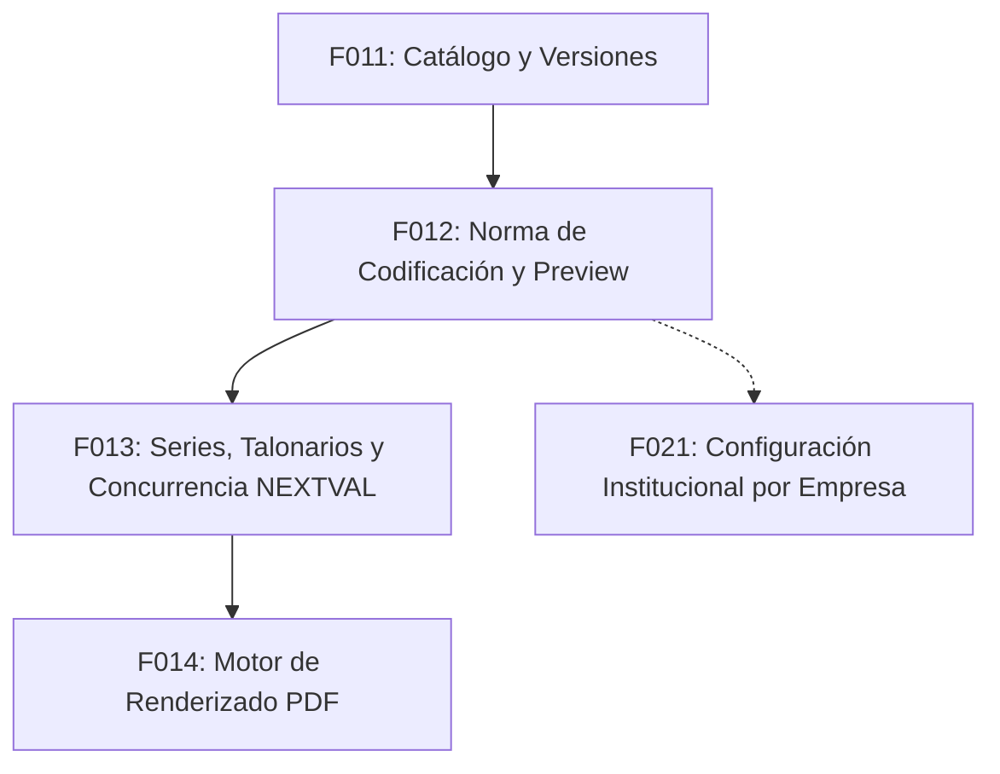

# Estándar Canónico de Códigos Documentales — TIPO-SEDE-AÑO-CORRELATIVO

## 1. Norma Canónica de Formato

El Sistema Logístico Integral define como norma técnica de visualización e identificación para todos los documentos de alcance interno (`document_scope = INTERNAL`) la siguiente estructura de cuatro segmentos:

$$\mathbf{\{TYPE\}-\{BRANCH\}-\{YEAR\}-\{SEQUENCE\}}$$

### Ejemplos Canónicos Ilustrativos
- `PO-LIM-2026-000001` (Orden de Compra, Sede Lima, Año 2026, Correlativo 1)
- `REQ-LIM-2026-000042` (Requerimiento de Compra, Sede Lima, Año 2026, Correlativo 42)
- `ODS-AQP-2026-001527` (Orden de Servicio, Sede Arequipa, Año 2026, Correlativo 1527)
- `GRN-DEMO-LIM-2026-000100` (Guía de Recepción, Sede con guion `DEMO-LIM`, Año 2026, Correlativo 100)

> [!NOTE]
> Los códigos de tipo y sede reales provienen de PostgreSQL (`document_types.code` y `branches.code`). Nunca deben hardcodearse en el cliente ni asumirse como fijos.

---

## 2. Decisión Técnica F012 — Ancho de Correlativo (`CORRELATIVE_WIDTH = 6`)

El Plan Maestro establece la estructura por segmentos sin fijar la longitud exacta del correlativo numérico. Como **decisión técnica canónica F012 (`DECISION_F012_CORRELATIVE_WIDTH = 6`)**, la secuencia numérica se formatea con un ancho de 6 dígitos mediante relleno con ceros a la izquierda (*zero-padding*):
- `1` $\rightarrow$ `000001`
- `42` $\rightarrow$ `000042`
- `1527` $\rightarrow$ `001527`

Esta longitud es configurable y desacoplada a nivel de política para admitir futuras configuraciones institucionales por organización en **F021** (`ORGANIZATION_NUMBERING_CONFIGURATION = FUTURE_PHASE_OWNER_F021`).

---

## 3. Identidad Estructurada vs. Representación Visible

El código visible formateado (ej. `PO-DEMO-LIM-2026-000001`) es una **representación de presentación**. La identidad técnica y operacional de cualquier asignación documental se persiste de forma completamente estructurada en la base de datos:

| Atributo Estructurado | Tipo de Dato | Origen y Descripción |
| :--- | :--- | :--- |
| `organization_id` | `UUID` | Identificador de la organización propietaria |
| `document_type_id` | `UUID` | Identificador del tipo documental |
| `branch_id` | `UUID` | Identificador de la sede emisora |
| `period_year` | `INTEGER` | Año calendario de emisión ($2000 \le \text{year} \le 2100$) |
| `correlative` | `INTEGER` | Secuencia incremental positiva ($\ge 1$) |
| `display_code` | `VARCHAR(100)` | Código canónico pre-renderizado |

> [!WARNING]
> **Prohibición de Parsing por Cadena**: Queda estrictamente prohibido intentar recuperar la sede, el tipo o el año haciendo `display_code.split("-")`. Dado que los códigos de sede pueden contener guiones (ej. `DEMO-LIM`), la separación por guiones causaría ambigüedad sintáctica. Toda consulta u operación debe basarse en las claves foráneas estructuradas.

---

## 4. Alcance de Unicidad (`DISPLAY_CODE_UNIQUENESS_SCOPE = ORGANIZATION`)

La unicidad de la numeración interna está formalmente circunscrita al ámbito de la organización:

$$\mathbf{UNIQUE(organization\_id, document\_type\_id, branch\_id, period\_year, correlative)}$$

Dos organizaciones distintas pueden poseer el mismo `display_code` (ej. Organización A: `PO-LIM-2026-000001` y Organización B: `PO-LIM-2026-000001`), garantizando el aislamiento *multi-tenant* mediante el `organization_id` sin alterar la estética canónica del código visible.

---

## 5. Política de No Reutilización (`REUSE_POLICY = NEVER`)

Una vez que un correlativo es asignado por el motor de numeración (**F013**), **NUNCA puede volver a ser utilizado ni reasignado**, bajo ninguna circunstancia.

Esta regla aplica de forma incondicional aunque el documento sufra posteriormente:
- `VOID` (Anulación)
- `CANCELLED` (Cancelación)
- `REJECTED` (Rechazo)
- `ERROR` o fallo de procesamiento

### Continuidad vs. No Reutilización
El sistema garantiza **NO DUPLICACIÓN + NO REUTILIZACIÓN**. Debido a reservas concurrentes o anulaciones legítimas, pueden existir huecos en la secuencia numérica. El sistema no fuerza contigüidad artificial a costa de reutilizar números asignados.

---

## 6. Documentos Externos y Oficiales (`EXTERNAL_PRESERVED`)

Para documentos con alcance externo (`document_scope = EXTERNAL`), tales como:
- `PSC` (Guía de Remisión Proveedor)
- `BOL` (Carta de Porte / Bill of Lading)
- `EX_INV` (Factura Comercial de Proveedor)

Aplica la política de **Preservación Legal**:
1. `preserve_external_number = true`: La aplicación conserva exactamente la serie (`official_series`, ej: `F001`, `T001`) y el número legal (`official_number`, ej: `00004567`) emitidos por la entidad externa.
2. La aplicación **NO renombra, NO renumera y NO genera correlativos internos** en reemplazo del número oficial de origen.
3. **Identidad Dual**: Cuando las normas tributarias o de auditoría requieran registrar un identificador técnico de recepción interna junto a la serie/número legal original, ambos datos coexisten de manera desacoplada sin sobreescritura.

---

## 7. Garantía de Vista Previa (`PREVIEW_ALLOCATES_NUMBER = false`)

El endpoint de vista previa (`POST /api/logistics/document-numbering/preview`):
- Es una operación de **solo lectura / cálculo**.
- **NO consume, NO reserva, NO persiste y NO asigna** correlativos en la base de datos.
- Requiere autenticación y el permiso `document_catalog.read`.
- Valida que la sede pertenezca a la organización del usuario (`BRANCH_ORGANIZATION_MISMATCH`).

---

## 8. Límites y Responsabilidades por Fase

- **F012 (Esta Fase)**: Define la norma canónica, validadores, política de preservación, endpoints de standard y preview, y UI de consulta.
- **F013 (`CORRELATIVE_ALLOCATION`, `SERIES_ENGINE`, `TALONARIOS`)**: Implementará la asignación transaccional con bloqueo de concurrencia, series digitales, talonarios físicos y consumo real de correlativos.
- **F014 (`PDF_RENDERER`)**: Implementará el renderizado de documentos a PDF.
- **F021 (`ORGANIZATION_NUMBERING_CONFIGURATION`)**: Permitirá configurar aspectos institucionales de numeración por empresa sin alterar la semántica canónica.
